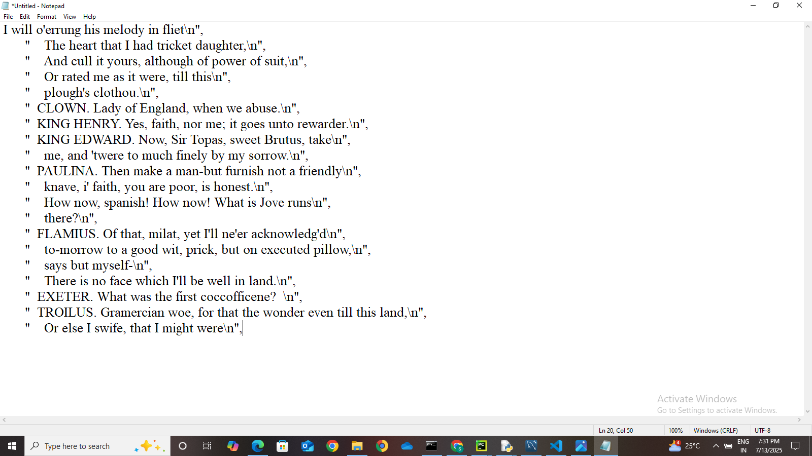

# 🧠 Text Generation with Deep Learning Approaches in NLP

This project explores various **deep learning techniques** for **natural language text generation**, focusing on building models that can learn language patterns and generate human-like text. It highlights approaches such as RNNs, LSTMs, and Transformer-based architectures applied to textual datasets.

## 🎯 Objective

To implement and compare deep learning-based methods for text generation using Natural Language Processing (NLP), with the aim to produce contextually relevant and coherent text automatically. This work demonstrates how machines can learn language structures and create meaningful text, useful in chatbots, creative writing, and content automation.

## 🚀 Key Features

- 📚 Preprocessing and tokenization of text datasets  
- 🔁 Sequence modeling using RNN and LSTM  
- 🚀 Transformer-based model implementation  
- 📈 Evaluation using metrics like Perplexity  
- 📝 Generated text samples for qualitative review  
- 📊 Visualization of training loss and model outputs  

## 💡 Why This Project?

Text generation is one of the key tasks in NLP, useful in applications like:
- Chatbots & conversational AI  
- Story/poem/article generation  
- Auto-completion and summarization  
This project shows the power of deep learning in mimicking human language.

## 🧰 Tech Stack

- Python 🐍  
- TensorFlow 
- Keras  
- NumPy, Pandas  
- Matplotlib 
- Jupyter Notebook
---

## ▶️ How to Run

1. Clone the repository:
```bash
git clone https://github.com/vimjamsamatha2018/major_project.git
cd major_project
```

## 📸 Screenshot-HomePage Preview

.

## 🙌 Contributing
Pull requests are welcome! For major changes, open an issue to discuss what you want to improve.
> 🔁 Replace `"your-username"` with your GitHub username.  
> 📷 Add screenshots or generated text images in a `screenshots/` folder.  
> Let me know if you want a **GitHub Pages demo**, **paper link**, or **Jupyter Notebook upload instructions**.


